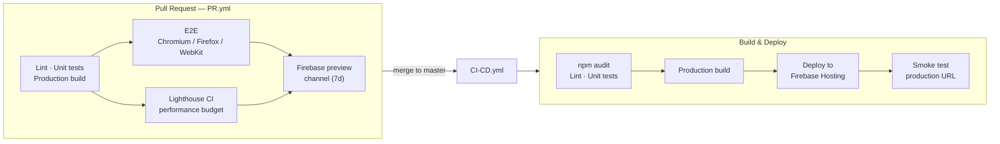

<div align="center">


# Concurso Homebrewer Córdoba

Official website of Córdoba's homebrewing competition — a BJCP-sanctioned contest run by **The Real CordobALE**.

[](https://github.com/jesuscorral/Concurso.homebrewer.cordoba/actions/workflows/CI-CD.yml)
[](https://github.com/jesuscorral/Concurso.homebrewer.cordoba/actions/workflows/PR.yml)
[](LICENSE.md)
[](https://www.concursohomebrewercordoba.es/)

</div>

---

## About

Public marketing & registration site for the contest: rules, sponsors, organization info, and an online entry form — covering **home, rules, sponsors, organization, registration and contact** routes, all statically pre-rendered.

## Built with

<div align="center">


</div>

## Highlights

- **Angular 22, standalone components**, built on the esbuild/Vite-based application builder.
- **Static site generation (SSR/SSG)** — every route is pre-rendered at build time for fast first paint and crawlable HTML; all app code is written SSR-safe.
- **SEO-first**: per-route `<title>`/meta descriptions and JSON-LD structured data managed by a dedicated `SeoService`.
- **Performance budget enforced in CI**: production bundle capped at 1&nbsp;MB (real-world size ≈925&nbsp;KB), audited automatically by Lighthouse CI on every pull request.
- **Privacy by design**: GDPR cookie-consent banner — Google Tag Manager/Analytics only loads after explicit visitor consent.
- **Cross-browser E2E coverage** with Playwright (Chromium, Firefox, WebKit) on every pull request.
- **Supply-chain hardening**: `npm audit` gate on every build, Dependabot grouped updates (npm + GitHub Actions), and third-party Actions pinned to commit SHA.
- **Zero-downtime, serialized deploys**: production deploys are concurrency-locked so two releases never race each other.
- **Bonus tooling**: [`Labels-sender/`](Labels-sender) — a small Python utility that reads participant entries from Excel, generates QR-coded bottle labels as PDFs, and emails them out.

## CI/CD pipeline

Every pull request runs a full quality gate before anything reaches `master`; every merge to `master` deploys automatically.



| Stage | Tooling | Purpose |
|---|---|---|
| Dependency audit | `npm audit --omit=dev` | blocks high-severity vulnerabilities in production deps |
| Lint | ESLint (TS + Angular templates) | static code quality |
| Unit tests | Vitest | component/service logic |
| E2E tests | Playwright | real-browser regression across 3 engines |
| Performance | Lighthouse CI | enforces the 1&nbsp;MB bundle budget |
| Preview deploys | Firebase Hosting channels | reviewable, shareable preview per PR (auto-expires in 7 days) |
| Production deploy | Firebase Hosting + smoke check | automatic on every push to `master` |

Workflow definitions: [`CI-CD.yml`](.github/workflows/CI-CD.yml) · [`PR.yml`](.github/workflows/PR.yml) · [`dependabot.yml`](.github/dependabot.yml)

---

<details>
<summary><strong>Getting started (click to expand)</strong></summary>

### Requirements

- **Node.js 24.18.0** (or another version satisfying `^22.22.3 || ^24.15.0 || >=26.0.0`, per Angular 22's engine requirement). If you use [nvm](https://github.com/coreybutler/nvm-windows), this repo has an `.nvmrc`:
  ```sh
  nvm install 24.18.0
  nvm use 24.18.0
  ```
- **npm** (bundled with Node). Do not use `yarn` — the project and its CI/CD pipeline are npm-based.

### Running locally / debugging

1. Clone the repo and install dependencies:
   ```sh
   git clone https://github.com/jesuscorral/Concurso.homebrewer.cordoba.git
   cd Concurso.homebrewer.cordoba
   npm install
   ```
2. Start the dev server:
   ```sh
   npm start
   ```
   This runs `ng serve` and rebuilds automatically on file changes (hot reload). Open **http://localhost:4200** in your browser.
3. **Debug in the browser:** open DevTools (F12) → *Sources* tab. Your original `.ts` files appear there (source maps are enabled by default in dev builds), so you can set breakpoints directly in TypeScript source instead of the bundled output.
4. **Debug in VS Code:** with the dev server running, use the built-in JavaScript debugger to attach to Chrome, e.g. a `.vscode/launch.json` entry:
   ```json
   {
     "type": "chrome",
     "request": "launch",
     "name": "Launch Chrome against localhost",
     "url": "http://localhost:4200",
     "webRoot": "${workspaceFolder}"
   }
   ```

### Other useful commands

```sh
npm run lint                          # ESLint (TS + templates)
npx vitest run --coverage                             # Vitest unit tests
npm run test:coverage                 # Vitest with coverage report
npm run e2e                           # Playwright end-to-end tests
npm run build                         # production build (default), output in dist/
npm run build:dev                     # development build (sourcemaps, no optimization)
```

### Deployment

Deployment to Firebase Hosting is automated: every push to `master` triggers [`.github/workflows/CI-CD.yml`](.github/workflows/CI-CD.yml), which builds the app and deploys `dist/` via `firebase-hosting-deploy`. Manual deploy (requires the [Firebase CLI](https://firebase.google.com/docs/cli) and access to the `concursohomebrewercordob-6d540` project):

```sh
npm run build
firebase deploy
```

</details>

## License

[MIT](LICENSE.md)
